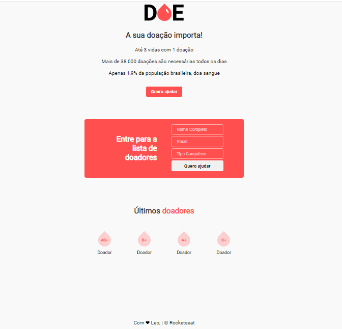

</img>
<h1 align="center">Maratona Dev 3</h1>

Projeto <strong>Doe Sangue</strong> Desenvolvido durante a 3ª Edição da MaratonaDev da Rocketseat

  </a>
    <a aria-label="Dias" href="https://rocketseat.com.br/maratonadev/aulas/3.0?aula=1">
    </img>
  </a>
  
  <a aria-label="Repo Size" href="README.md">
  	</img>
  </a>

## 🩸 Projeto

#### O Doe Sangue é um projeto para incentivar, encontrar e registrar doadores de sangue.

## ⚛️ Frontend

#### obs: a página está com zoom de 50%
</img>
